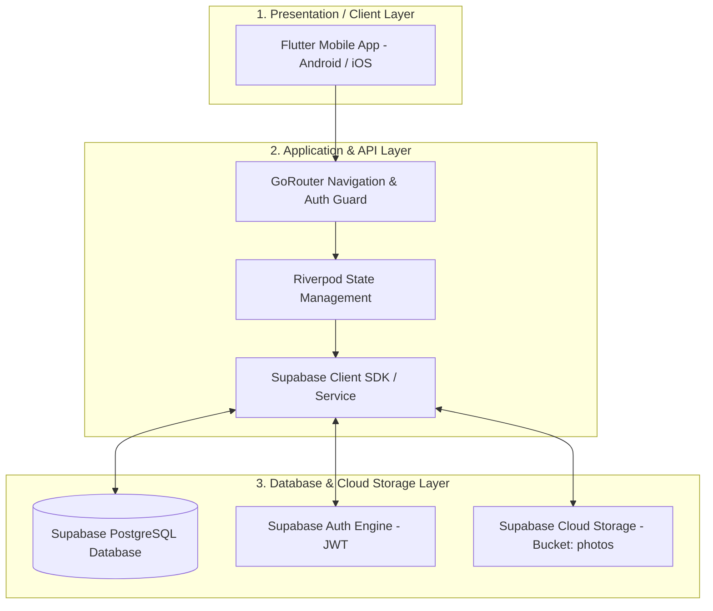
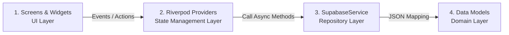
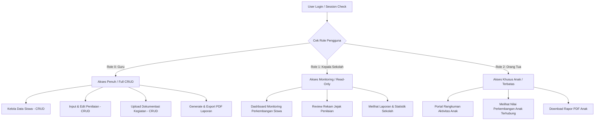
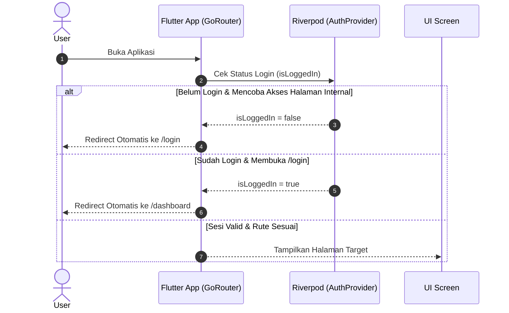
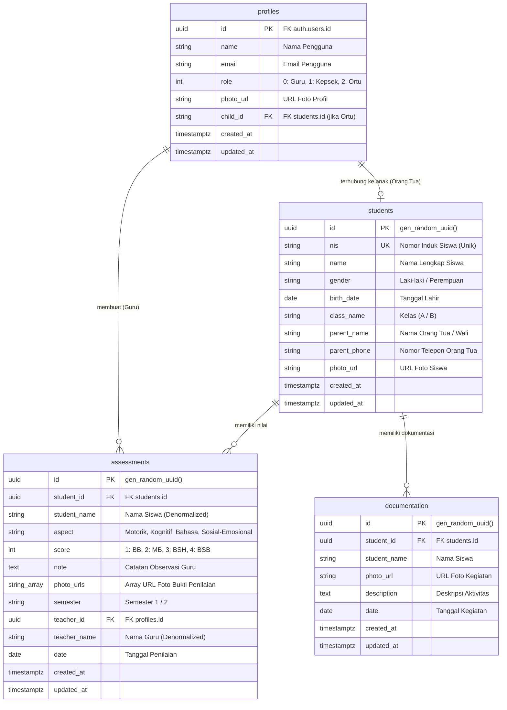

# 📘 Dokumen Rancangan, Database, dan Implementasi Sistem
## TK Islam Safa - Sistem Informasi Penilaian & Administrasi Siswa

Dokumen ini berisi dokumentasi teknis komprehensif mengenai **Rancangan Sistem**, **Struktur Database**, dan **Implementasi Teknologi** untuk aplikasi mobile **TK Islam Safa**. Dokumen ini dirancang sebagai panduan teknis dan acuan presentasi demo sistem.

---

## 📑 Daftar Isi
1. [1. Rancangan Sistem (System Architecture)](#1-rancangan-sistem-system-architecture)
   - [1.1 Arsitektur Tingkat Tinggi (High-Level 3-Tier Architecture)](#11-arsitektur-tingkat-tinggi-high-level-3-tier-architecture)
   - [1.2 Arsitektur Kode Frontend (Clean Layered Architecture)](#12-arsitektur-kode-frontend-clean-layered-architecture)
   - [1.3 Rancangan Hak Akses (Role-Based Access Control - RBAC)](#13-rancangan-hak-akses-role-based-access-control---rbac)
   - [1.4 Alur Navigasi & Auth Guard (GoRouter & Riverpod)](#14-alur-navigasi--auth-guard-gorouter--riverpod)
2. [2. Struktur Database (Database Schema & ERD)](#2-struktur-database-database-schema--erd)
   - [2.1 Entity Relationship Diagram (ERD)](#21-entity-relationship-diagram-erd)
   - [2.2 Rincian Tabel PostgreSQL](#22-rincian-tabel-postgresql)
   - [2.3 Keamanan Level Database (Row Level Security & Triggers)](#23-keamanan-level-database-row-level-security--triggers)
   - [2.4 Cloud Object Storage](#24-cloud-object-storage)
3. [3. Implementasi Sistem (System Implementation & Stack)](#3-implementasi-sistem-system-implementation--stack)
   - [3.1 Technology Stack Utama](#31-technology-stack-utama)
   - [3.2 Struktur Direktori Source Code (`lib/`)](#32-struktur-direktori-source-code-lib)
   - [3.3 Alur Kerja Fitur Utama](#33-alur-kerja-fitur-utama)
   - [3.4 Simulasi Tanya Jawab Demo (Q&A Cheat Sheet)](#34-simulasi-tanya-jawab-demo-qa-cheat-sheet)

---

## 1. Rancangan Sistem (System Architecture)

### 1.1 Arsitektur Tingkat Tinggi (High-Level 3-Tier Architecture)

Aplikasi TK Islam Safa menggunakan pendekatan **3-Tier Architecture** yang memisahkan antara antarmuka pengguna seluler (*mobile client*), logika bisnis & manajemen status (*service layer*), dan pemrosesan basis data cloud (*database layer*).



#### Penjelasan Komponen Arsitektur:
1. **Presentation Layer**: Dibangun menggunakan **Flutter Framework (Dart)** untuk platform mobile (Android & iOS).
2. **Application & State Management Layer**:
   - **GoRouter**: Mengatur rute navigasi aplikasi serta memproteksi rute internal dari akses tanpa autentikasi (*Auth Guard*).
   - **Riverpod**: Mengelola state reaktif aplikasi secara terisolasi di luar pohon widget (*widget tree*).
   - **SupabaseService**: Layanan repositori yang mengisolasi panggilan REST API & WebSocket ke Supabase Backend.
3. **Database & Storage Layer**:
   - **PostgreSQL**: Basis data relasional Supabase untuk menyimpan data profil, siswa, penilaian, dan dokumentasi.
   - **Supabase Auth**: Engine autentikasi berbasis enkripsi token JWT.
   - **Object Storage**: Bucket cloud (`photos`) untuk penyimpanan berkas gambar/foto.

---

### 1.2 Arsitektur Kode Frontend (Clean Layered Architecture)

Struktur kode di dalam direktori `lib/` mengadopsi prinsip **Separation of Concerns (SoC)** dengan pembagian 4 layer utama:



- **UI Layer (`lib/screens/` & `lib/widgets/`)**: Berisi komponen antarmuka yang hanya bertugas merender tampilan dan menerima masukan pengguna.
- **State Management Layer (`lib/providers/`)**: Mengelola logika bisnis dan state reaktif. UI mendengarkan (*watch*) provider ini.
- **Repository / Service Layer (`lib/services/`)**: Menangani pertukaran data ke Supabase API.
- **Domain Layer (`lib/models/`)**: Deklarasi objek data (`User`, `Student`, `Assessment`, `Documentation`) beserta method parsing `fromSupabase` dan `toSupabase`.

---

### 1.3 Rancangan Hak Akses (Role-Based Access Control - RBAC)

Sistem menerapkan pembagian hak akses eksplisit berdasarkan `role` pada profil pengguna:



---

### 1.4 Alur Navigasi & Auth Guard (GoRouter & Riverpod)



---

## 2. Struktur Database (Database Schema & ERD)

### 2.1 Entity Relationship Diagram (ERD)

Basis data PostgreSQL di Supabase dirancang secara relasional sebagai berikut:



---

### 2.2 Rincian Tabel PostgreSQL

#### 1. Tabel `profiles`
Menyimpan informasi pengguna tambahan yang terhubung dengan akun otentikasi Supabase.
- `id` (UUID, Primary Key): Referensi langsung ke `auth.users(id)` dengan opsi `ON DELETE CASCADE`.
- `name` (TEXT): Nama lengkap pengguna.
- `email` (TEXT): Alamat email terdaftar.
- `role` (INTEGER): Peran pengguna (`0` = Guru, `1` = Kepala Sekolah, `2` = Orang Tua).
- `photo_url` (TEXT, Optional): Tautan foto profil.
- `child_id` (TEXT, Optional): ID siswa yang terhubung jika role adalah Orang Tua.

#### 2. Tabel `students`
Menyimpan identitas lengkap peserta didik di TK Islam Safa.
- `id` (UUID, Primary Key): Default `gen_random_uuid()`.
- `nis` (TEXT, Unique): Nomor Induk Siswa yang unik.
- `name` (TEXT): Nama lengkap siswa.
- `gender` (TEXT): Jenis kelamin ("Laki-laki" / "Perempuan").
- `birth_date` (DATE): Tanggal lahir siswa.
- `class_name` (TEXT): Rombongan belajar / kelas ("A" atau "B").
- `parent_name` (TEXT): Nama orang tua/wali.
- `parent_phone` (TEXT): Nomor WhatsApp/Telepon orang tua.

#### 3. Tabel `assessments`
Menyimpan data evaluasi perkembangan harian dan berkala siswa.
- `id` (UUID, Primary Key).
- `student_id` (UUID, Foreign Key ke `students.id` dengan `ON DELETE CASCADE`).
- `aspect` (TEXT): Aspek perkembangan ("Motorik", "Kognitif", "Bahasa", "Sosial-Emosional").
- `score` (INTEGER): Tingkat capaian (`1` = Belum Berkembang / BB, `2` = Mulai Berkembang / MB, `3` = Berkembang Sesuai Harapan / BSH, `4` = Berkembang Sangat Baik / BSB).
- `note` (TEXT): Catatan kualitatif dari guru penilai.
- `photo_urls` (TEXT[]): Array berisi URL foto bukti kegiatan penilaian.
- `semester` (TEXT): Periode semester ("Semester 1" / "Semester 2").
- `teacher_id` (UUID, Foreign Key ke `profiles.id`).

#### 4. Tabel `documentation`
Menyimpan berkas galeri dan dokumentasi kegiatan belajar mengajar siswa.
- `id` (UUID, Primary Key).
- `student_id` (UUID, Foreign Key ke `students.id`).
- `photo_url` (TEXT): URL foto kegiatan yang tersimpan di Supabase Storage.
- `description` (TEXT): Keterangan aktivitas siswa.
- `date` (DATE): Tanggal pelaksanaan kegiatan.

---

### 2.3 Keamanan Level Database (Row Level Security & Triggers)

1. **Row Level Security (RLS)**: Seluruh tabel diaktifkan RLS-nya (`ALTER TABLE ... ENABLE ROW LEVEL SECURITY;`) untuk menjamin bahwa data hanya dapat dibaca/diubah oleh sesi pengguna terotentikasi (*authenticated users*).
2. **Database Trigger (`handle_new_user`)**:
   ```sql
   CREATE OR REPLACE FUNCTION public.handle_new_user()
   RETURNS TRIGGER AS $$
   BEGIN
     INSERT INTO public.profiles (id, name, email, role)
     VALUES (
       NEW.id,
       COALESCE(NEW.raw_user_meta_data->>'name', ''),
       NEW.email,
       COALESCE((NEW.raw_user_meta_data->>'role')::INTEGER, 0)
     );
     RETURN NEW;
   END;
   $$ LANGUAGE plpgsql SECURITY DEFINER;

   CREATE TRIGGER on_auth_user_created
     AFTER INSERT ON auth.users
     FOR EACH ROW EXECUTE FUNCTION public.handle_new_user();
   ```
3. **Database Indexing**: Indeks PostgreSQL dibuat pada kolom pencarian intensif (`nis`, `class_name`, `student_id`, `teacher_id`, `semester`) untuk mengoptimalkan kecepatan query.

---

### 2.4 Cloud Object Storage

Sistem menyediakan 1 Bucket Storage publik bernama `photos` di Supabase Storage untuk menampung seluruh berkas gambar:
- Kebijakan Akses (*Storage Policies*):
  - **Insert / Upload**: Pengguna terotentikasi (*authenticated users*).
  - **Select / View**: Publik (*public access* agar gambar dapat dirender di aplikasi mobile).
  - **Delete**: Pengguna terotentikasi.

---

## 3. Implementasi Sistem (System Implementation & Stack)

### 3.1 Technology Stack Utama

| Layer / Komponen | Teknologi | Deskripsi Implementasi |
|---|---|---|
| **Frontend Framework** | `Flutter (v3.0+)` & `Dart` | SDK UI multi-platform untuk platform Android dan iOS. |
| **State Management** | `flutter_riverpod (^2.4.9)` | Manajemen state reaktif terpisah dari UI layer. |
| **Routing & Navigasi** | `go_router (^13.0.0)` | Navigasi deklaratif dilengkapi *auth redirection guard*. |
| **Backend & DB** | `supabase_flutter (^2.3.0)` | Backend-as-a-Service untuk Auth, Database PostgreSQL, dan File Storage. |
| **Penyimpanan Lokal** | `shared_preferences (^2.2.2)` | Caching data sesi login pengguna secara offline pada memori HP. |
| **PDF Generator** | `pdf (^3.10.7)` | Membuat dan merender dokumen rapor perkembangan anak menjadi PDF. |
| **Media & Gallery** | `image_picker (^1.0.7)` | Membuka galeri foto dan kamera HP untuk upload foto kegiatan. |
| **Environment Vars** | `flutter_dotenv (^5.1.0)` | Mengisolasi kredensial `SUPABASE_URL` dan `SUPABASE_ANON_KEY` pada file `.env`. |

---

### 3.2 Struktur Direktori Source Code (`lib/`)

```text
lib/
├── app/
│   ├── app.dart                   # Inisialisasi MaterialApp.router & Theme
│   └── routes.dart                # Konfigurasi GoRouter & Auth Redirect Guard
├── config/
│   ├── colors.dart                # Palet warna utama aplikasi (Material Design 3)
│   ├── radius.dart                # Token ukuran kelengkungan sudut (BorderRadius)
│   ├── shadows.dart               # Token bayangan UI (Elevation/BoxShadow)
│   ├── spacing.dart               # Token jarak (Padding/Margin)
│   ├── supabase_config.dart       # Inisialisasi Supabase SDK
│   ├── theme.dart                 # Konfigurasi ThemeData utama
│   └── typography.dart            # Pengaturan font Google Fonts Inter
├── models/
│   ├── user.dart                  # Model Data User & Profile
│   ├── student.dart               # Model Data Siswa
│   ├── assessment.dart            # Model Data Penilaian Perkembangan
│   └── documentation.dart         # Model Data Dokumentasi Kegiatan
├── providers/
│   ├── auth_provider.dart         # State Management Autentikasi & Sesi User
│   ├── student_provider.dart      # State Management CRUD Siswa
│   ├── assessment_provider.dart   # State Management CRUD Penilaian
│   └── documentation_provider.dart# State Management CRUD Dokumentasi Foto
├── screens/
│   ├── auth/                      # Layar Login & Register
│   ├── dashboard/                 # Dashboard Guru, Kepsek, & Orang Tua
│   ├── siswa/                     # Layar List, Detail, & Form Siswa
│   ├── penilaian/                 # Layar List & Form Penilaian
│   ├── dokumentasi/               # Layar Galeri & Upload Dokumentasi
│   ├── laporan/                   # Layar Generate & Preview PDF Rapor
│   ├── monitoring/                # Layar Monitoring Statistik (Kepsek)
│   ├── profil/                    # Layar Profil, Edit Profil, & Ganti Password
│   └── splash/                    # Layar Splash Screen & Check Auth
├── services/
│   └── supabase_service.dart      # Service Repository Komunikasi API Supabase
├── utils/
│   └── storage.dart               # Helper SharedPreferences
└── main.dart                      # Entry Point Aplikasi & ProviderScope
```

---

### 3.3 Alur Kerja Fitur Utama

#### 1. Alur Autentikasi & Handling Sesi
1. Aplikasi dimulai di `main.dart`, menginisialisasi `SupabaseConfig` dan `ProviderScope`.
2. `SplashScreen` memeriksa sesi login di `AuthProvider`.
3. Jika sesi ditemukan, `GoRouter` mengarahkan pengguna ke `/dashboard` sesuai role. Jika tidak, diarahkan ke `/login`.

#### 2. Alur Input Penilaian Siswa (Guru)
1. Guru membuka layar **Tambah Penilaian** (`PenilaianFormScreen`).
2. Guru memilih nama siswa, aspek perkembangan (Motorik, Kognitif, Bahasa, Sosial-Emosional), nilai capaian (BB/MB/BSH/BSB), catatan observasi, dan mengunggah foto kegiatan.
3. `AssessmentProvider` memanggil `SupabaseService.addAssessment()`.
4. `SupabaseService` mengirimkan query `INSERT` ke tabel `assessments` di PostgreSQL Supabase dan mengunggah foto ke storage bucket `photos`.

#### 3. Alur Cetak / Download Rapor PDF
1. Pengguna (Guru atau Orang Tua) membuka layar **Laporan** (`LaporanScreen`).
2. Sistem menyaring data penilaian siswa berdasarkan semester aktif.
3. Modul `pdf` merender susunan tata letak dokumen (kop TK Islam Safa, biodata siswa, tabel nilai per aspek, dan catatan guru).
4. Berkas PDF siap dipreview atau diunduh langsung ke penyimpanan internal HP.

---

### 3.4 Simulasi Tanya Jawab Demo (Q&A Cheat Sheet)

#### ❓ Q1: Mengapa menggunakan BaaS Supabase daripada membangun Backend REST API mandiri?
> **Jawaban:** 
> *"Penggunaan Supabase dipilih untuk efisiensi pengembangan dan keandalan sistem. Supabase menyediakan basis data PostgreSQL native yang mendukung Row Level Security (RLS), sistem otentikasi terenkripsi JWT, serta Cloud Object Storage untuk media foto dalam satu ekosistem terintegrasi. Hal ini mengurangi overhead pemeliharaan server backend mandiri dan memfokuskan pengembangan pada keandalan antarmuka serta logika bisnis aplikasi mobile."*

#### ❓ Q2: Bagaimana sistem menjamin keamanan data sehingga Orang Tua tidak melihat data anak lain?
> **Jawaban:**
> *"Keamanan dijamin pada 2 tingkat:*
> 1. * **Level Client (GoRouter & Riverpod)**: Saat login sebagai Orang Tua (`role: 2`), aplikasi membaca `child_id` dari profil pengguna dan secara otomatis menyaring tampilan data hanya untuk siswa terkait.*
> 2. * **Level Database (Row Level Security - RLS)**: Supabase menerapkan RLS di mana token JWT pengguna dikonfirmasi oleh database sebelum data dikembalikan."*

#### ❓ Q3: Mengapa memilih Riverpod daripada Provider biasa?
> **Jawaban:**
> *"Riverpod merupakan evolusi dari Provider yang menjamin Compile-time Safety (mencegah error runtime `ProviderNotFoundException`). Selain itu, Riverpod tidak bergantung pada `BuildContext` sehingga pembagian logika bisnis antara UI dan Service Layer jauh lebih bersih dan mudah diuji (*unit test*)."*

---

Developed by **Kelompok 7 - DPSI 2026**  
Prodi Sistem Informasi — TK Islam Safa System Documentation
